<p align="center">
<h1 align="center">  Paper Writing Tips</h1>
</p>
[项目说明](https://github.com/Erutan-pku/Paper_Writing_Tips/blob/main/README.md#项目说明),
[写前必看](https://github.com/Erutan-pku/Paper_Writing_Tips/blob/main/README.md#写前必看), 
[终稿必查](https://github.com/Erutan-pku/Paper_Writing_Tips/blob/main/README.md#终稿必查——投稿前一周，一天),
[大佬们的写作建议](https://github.com/Erutan-pku/Paper_Writing_Tips/blob/main/README.md#大佬们的写作建议), 
[组织者列表](https://github.com/Erutan-pku/Paper_Writing_Tips/blob/main/README.md#组织者列表), 
[贡献者列表](https://github.com/Erutan-pku/Paper_Writing_Tips/blob/main/README.md#贡献者列表)

## 项目动机

很多初学者同学在投稿的时候经常会出现一些共有的小错误，为了节省大家的时间和帮助大家能够尽快的定位一些小的问题。本项目总结了我们在自己投稿过程中的经验和一些身边老师同学的投稿经验，希望能对大家有所帮助，由于我们的水平有限，如有疏漏，还望谅解。谢谢大家。

>本项目的特色：
>
>1. **写前必看**：包含一些常见的错误，每个错误均配有例子，可以在动手写论文之前快速浏览。
>2. **终稿必查**：包含一些例子，方便快速定位是否自己的论文有错误。
>3. **百家之言**：整理了一些网络上公开的写作资源（并不完全，欢迎补充），方便大家系统学习。


### 免责声明

本项目列举的所有技巧**仅供参考**，并不保证正确。所以论文写作以实际需求为准。熟悉写作技巧可能会使写作没有明显的失误，而优秀的论文需要不断打磨。
所有内容仅仅来自于笔者的个人经验，互联网数据，及笔者团队日常科研工作中的相关积累，以及笔者团队身边各位大佬的言传身教。有任何问题，欢迎联系。

### 欢迎贡献

Paper Writing Tips目前是一个正在进行的中项目，如有疏漏在所难免，欢迎任何的PR及issue讨论。

### 解释

下文中，标注"Attention"的内容，是目前组织者认为有（较为）明显争议的建议条目。

## 写前必看

### 公式符号

#### 1. 标量符号用小写拉丁字母表示

* 要点: 为避免混淆字母 l 和数字 1 ，字母 l 可用 \ell 替代。


#### 2. 推荐：有结构的值使用 \boldsymbol（Attention）

* 要点: 有结构的值有句子、树、图等

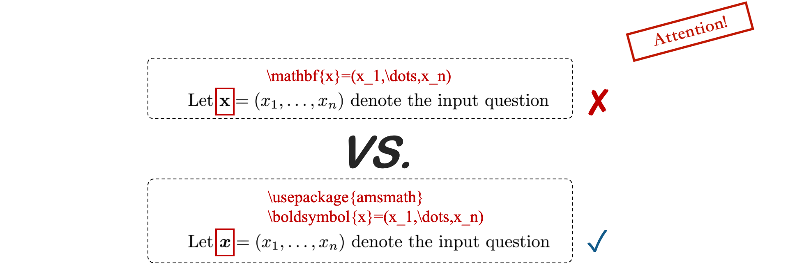

#### 3. 推荐：\boldsymbol 的集合可用 \mathcal （Attention）

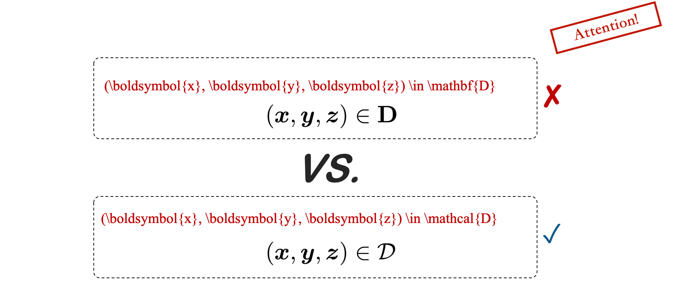

#### 4. 向量值小写加粗，矩阵大写加粗

* 要点: 拉丁字母用\mathbf，希腊字母用\boldsymbol。


#### 5. 推荐：数域、期望等使用\mathbff （Attention）

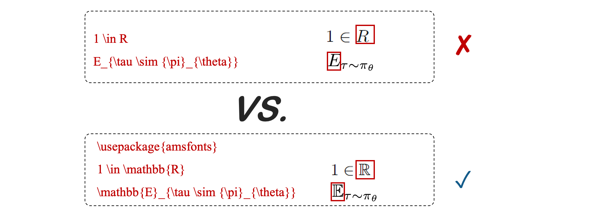

#### 6. 保持元素与集合的符号对应


#### 7. 写作风格要正式，避免缩写

* `don't` 拆开写成 `do not`
* 所有格 `'s` 尽量转化为 `of`

#### 8. 拉丁文惯用语

- `e.g.,` 表示 `for example,`
- `i.e.,` 表示 `that is,`
- `et al.` 表示 `and others of the same kind,`，在句末不用再添加句号
- `etc.` 表示 `and others,`，不用于列举人，在句末不用再添加句号

#### **9. 英文引号**

键位如图所示，使用 `` 和 '' 分别表示左右引号，而不是其他符号或任何中文引号。

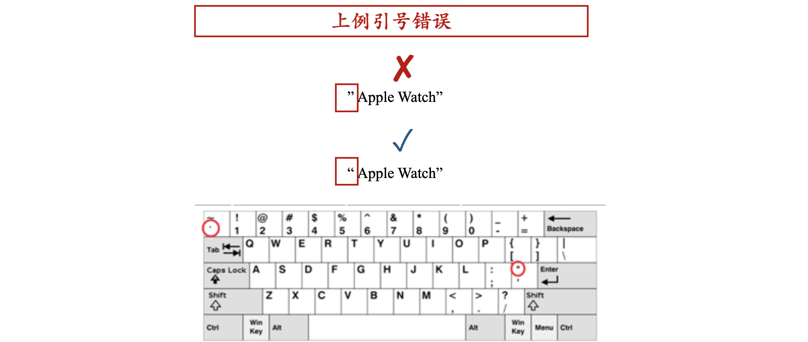

#### 10. 不间断空格 "~"

使用 `~` 表示不间断空格，不间断空格不会导致意外的换行，例如：

```latex
Figure~\ref{} shows the model performance.
Table~\ref{} shows dataset details.
We use BERT~\cite{bert} model.
Section~\ref{} concludes this paper.
```


#### 11. URI 链接

使用 `\uri{}` 命令，需要导入包：

```latex
 \usepackage{hyperref}
```


#### 12. 推荐：引号只表示所谓，不表示引用

引用的表述考虑使用斜体 `\textit{}` 而不是引号。


#### 13. 非单个字母的变量名

公式中的 `softmax`，`proj`，`enc` 等超过一个字母的变量或符号，使用正文字体，即使用 `\textrm` 或 `\textit` 命令。


#### 14. 使用函数命令

许多函数和符号有现成的命令，例如：`\arg{}`，`\max{}`，`\sin{}`，`\tanh{}`，`\inf`， `\det{}`， `\exp{}`.


#### 15. 公式中的括号，应通过\left，\right进行标记


-   如 \left(\right), \left{\right}, \left<\right>, \left|\right|等。
-   括号中的分割通过\middle实现。
-   Latex代码如下：
      ```Latex
      \begin{gather}
         \bold{s} = \left(\sum_{i=0}^{N-1}{\alpha_{i} \bold{h}_i}\right) + \bold{h}_N\\
         \bold{s} = (\sum_{i=0}^{N-1}{\alpha_{i} \bold{h}_i}) + \bold{h}_N \\
      \end{gather}
      
      \begin{gather}
         \left\{ x \middle| x\ne\frac{1}{2}\right\} \\ 
         \{ x | x\ne\frac{1}{2}\}
      \end{gather}
      ```

#### 16. 使用 align 表示一组公式，等号对齐


-   使用 align 表示一组公式，等号对齐。
-   Latex代码如下：
      ```Latex
      \begin{gather}
         E = m c^2 \\
         C = B \log_2\left(1+\frac{S}{N}\right)
      \end{gather}
      
      \begin{align}
         E &= m c^2 \\
         C &= B \log_2\left(1+\frac{S}{N}\right)
      \end{align}
      ```

#### 17. 只对refer的公式中加编号（Attention）


-   推荐：只对refer的公式加编号，\nonumber去编号。
-   Latex代码如下：
      ```Latex
      \begin{equation}
         E = m c^2 
      \end{equation}
      
      \begin{equation}
         E = m c^2 \nonumber
      \end{equation}
      ```

### 表格图片

#### 18. 使用Booktabs绘制更好看的表格


-   绘制表格时，使用 \usepackage{booktabs}，从而借助 \toprule, \bottomrule, \midrule, \cmidrule 命令，画出好看的分隔线。
-   Latex代码如下：
      ```Latex
      % Example of a table with booktabs from https://nhigham.com/2019/11/19/better-latex-tables-with-booktabs/.
      % First version of table.
      \begin{table}[htbp]
         \centering
         \begin{tabular}{|l|c|c|c|c|c|l|}
            \hline
            & \multicolumn{3}{c|}{E} & \multicolumn{3}{c|}{F}\\
            \hline
                        & $mv$  & Rel.~err & Time    & $mv$  & Rel.~err & Time   \\\hline
            A    & 11034 & 1.3e-7 & 3.9 & 15846 & 2.7e-11 & 5.6 \\
            B & 21952 & 1.3e-7 & 6.2 & 31516 & 2.7e-11 & 8.8 \\
            C & 15883 & 5.2e-8 & 7.1 & 32023 & 1.1e-11 & 1.4 \\
            D  & 11180 & 8.0e-9 & 4.3 & 17348 & 1.5e-11 & 6.6 \\
            \hline
         \end{tabular}
         \caption{Without booktabs.}
         \label{tab:without-booktabs}
      \end{table}
      
      % Second version of table, with booktabs.
      \begin{table}[htbp]
         \centering
         \begin{tabular}{lcccccl}\toprule
            & \multicolumn{3}{c}{E} & \multicolumn{3}{c}{F}
            \\\cmidrule(lr){2-4}\cmidrule(lr){5-7}
                     & $mv$  & Rel.~err & Time    & $mv$  & Rel.~err & Time\\\midrule
            A    & 11034 & 1.3e-7 & 3.9 & 15846 & 2.7e-11 & 5.6 \\
            B & 21952 & 1.3e-7 & 6.2 & 31516 & 2.7e-11 & 8.8 \\
            C & 15883 & 5.2e-8 & 7.1 & 32023 & 1.1e-11 & 1.4\\
            D  & 11180 & 8.0e-9 & 4.3 & 17348 & 1.5e-11 & 6.6 
            \\\bottomrule
         \end{tabular}
         \caption{With booktabs.}
         \label{tab:with-booktabs}
      \end{table}
      ```

#### 19. 章节、表格、图片的引用

-   章节、表格、图片使用\label{...}定义后，通过\ref{...}自动引用跳转。
-   对子图或子表的引用可以使用Figure~\ref{fig:figure}(a)来表示。

#### 20. 不要把图表中的Caption在正文中复述

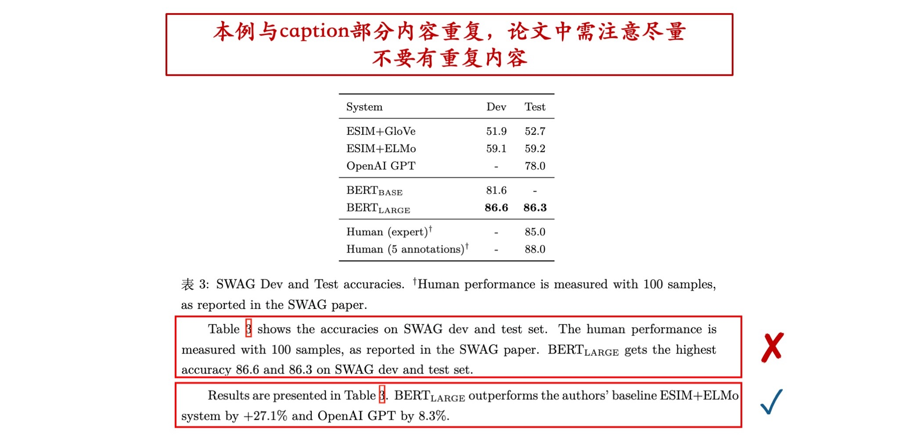

- 说明（Caption）是用来写“这个表格是什么”的。
- 正文是用来写“这个表格说明了什么”的。

#### 22. “三线表”建议：尽量不要画竖线（Attention）

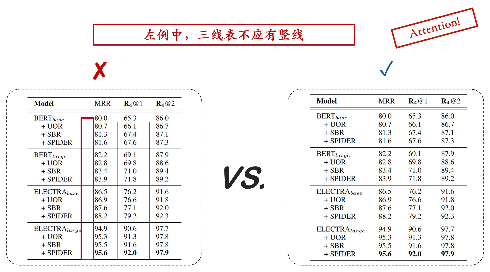

#### 23. 表格大小调整

- 用 \centering 居中；用\small，\scriptsize，\footnotesize，\tiny 调整字号
- 用\setlength{\tabcolsep}{8pt} 调整列间距
- 用 p{2cm} 固定列宽
- 用\multirow，\multicolumn 合并单元格

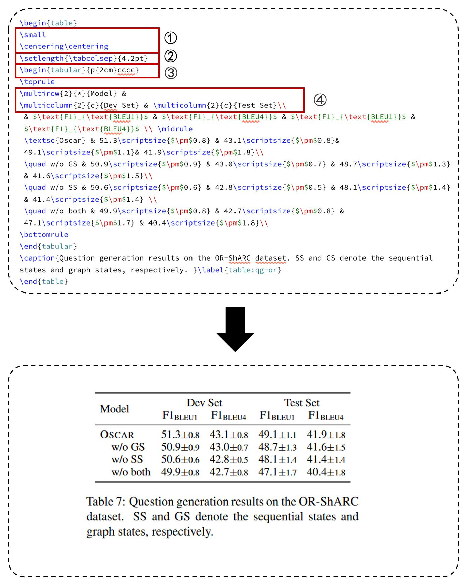

#### 24. 矢量图：图像应使用矢量图（如PDF格式）

- 使用Adobe illustrator、OmniGraffle等软件绘制后存为矢量图
- 使用Matplotlib绘制后存储: plt.savefig(‘draw.pdf’)
- 在LaTeX中使用pgfplots直接绘制

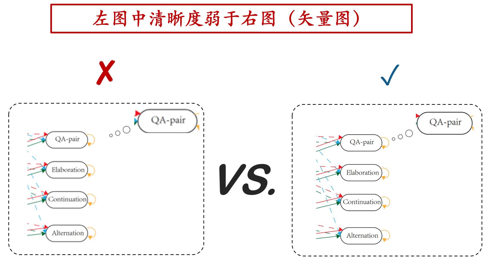

#### 25. 图片字体大小介于正文字体与caption之间

- 建议图中字体大小保持一致

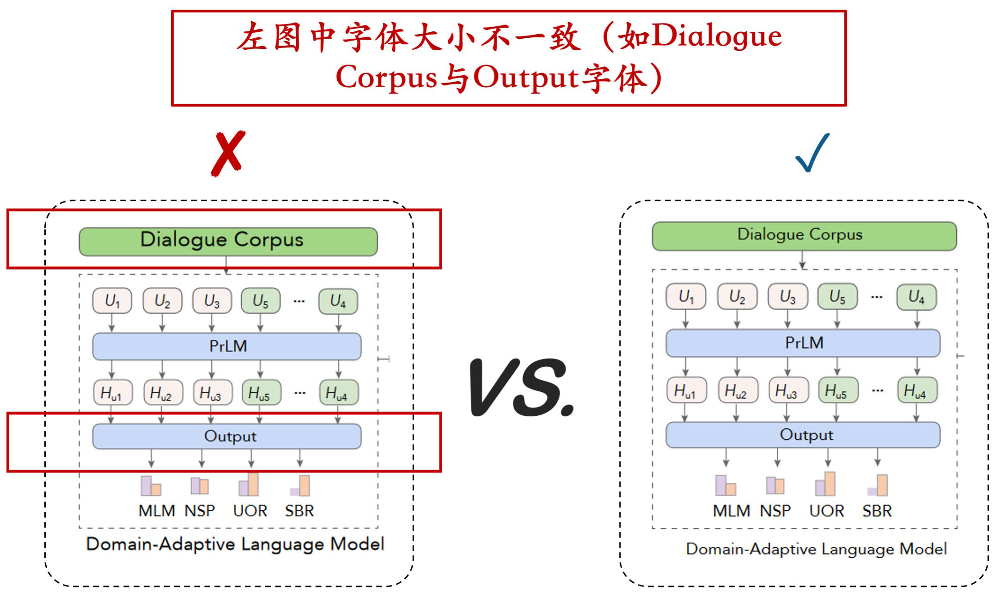

#### 26. 图表设计应适用于黑白打印

- 对黑白打印友好：不要以颜色作为指代图示中线条的唯一特征，可使用实线/虚线 ，亮/暗，不同线形等。


#### 27. 图片风格保持简洁美观

- 不要使用过多的颜色种类，避免过亮的颜色
- 使用简洁的图示，尽量少用文字描述（例子除外）
- 同样功能模块使用统一格式
- 箭头走向应趋于同一个方向

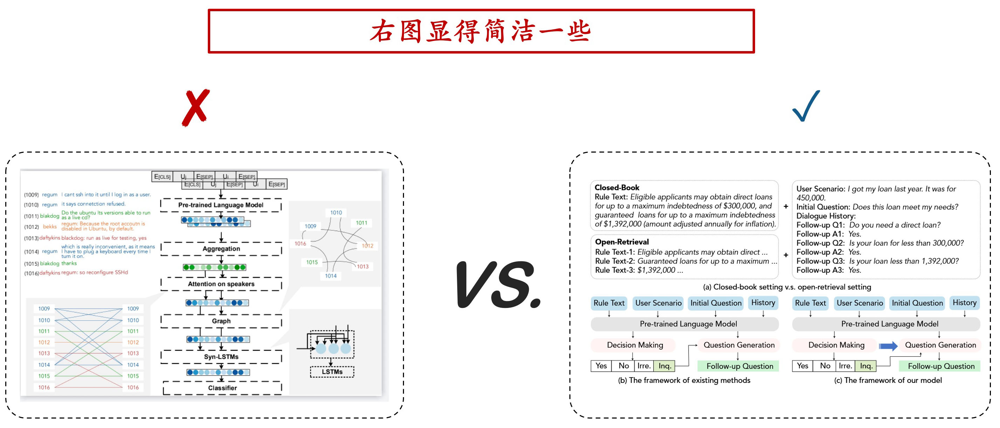

### 选词用词

#### 29. 注意连词符的词性

* 一般连词符中，最后一个词是名词的，连起来是形容词词性；


* 最后一个词是动词的，连起来是动词词性。


#### 30. 词性易错点

* **First**,  Secondly，均为副词
* training， **test**，validation，均为名词 

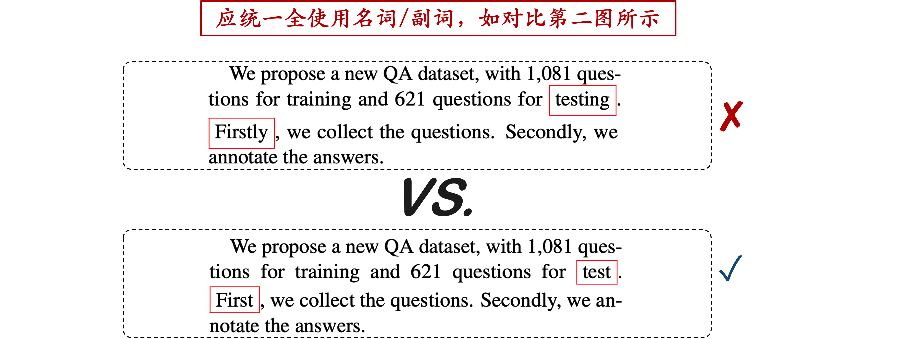

#### 31. 缩写符合使用习惯

* 符合习惯，与提出者尽量一致CNN，LSTM，FEVER，ConceptNet，SQuAD，BiDAF，FEVER score，Wikipedia。
* 初次出现时，全称在前，缩写在后；或缩写在前，用于注释的citation在后。graph attention network (GAT)，pre-trained language model (PLM)；BERT~\citep{BERT}。
* 领域名、任务名、指标等一般不需要大写，如 natural language processing, question answering, accuracy, macro-F1 score.


#### 32. 注意单复数

* 尤其是不规则单复数变化、不可数名词。

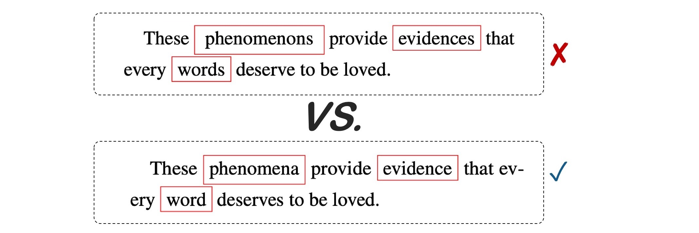

#### 33. a/an 跟着元音音素走


#### 34. the的使用

* 注意：一般不会独立出现（不用冠词）可数名词单数，要么加the特指，要么加复数泛指。


#### 35. 时态：以一般现在时为主（Attention）

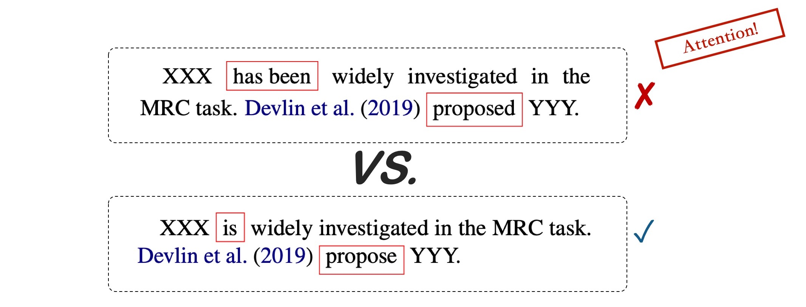

#### 36. 避免绝对化表述。

- 使用straightforward替换obvious
- 使用generally、usually、often替换always
- 使用rare替换never
- 使用alleviate、relieve替换avoid、eliminate

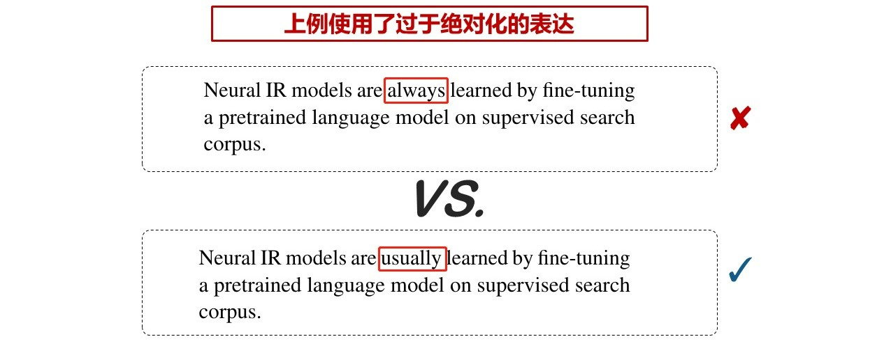

#### 37. 避免一些模糊的表述，比如：meaning, semantic, better等。

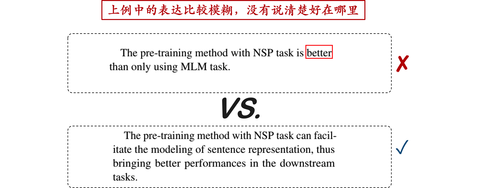

以better举例，也就是当表示一个事物更好时，不能仅仅说它更好，需要给出相应的解释与理由

### 句子表述

#### 38. 避免过多使用代词：it，they等，模型名缩写也不长，并且更清楚。

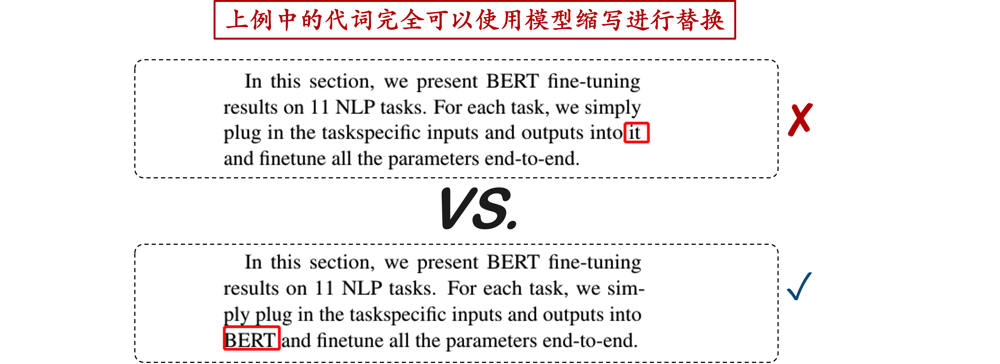

#### 39. 避免过多贴标签，比如在谈论效果好时。

提出的方法到底改善了哪里，是什么导致的这个结果？

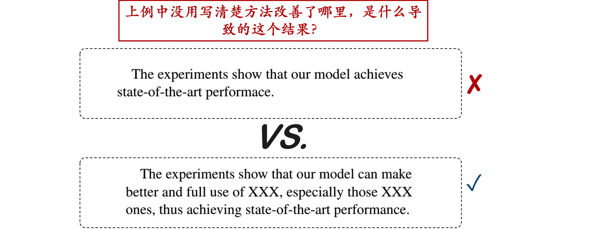

#### 40. 一句话说一件事。

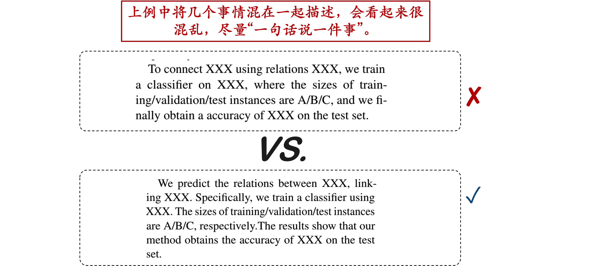

#### 41. 观察/发现？假设？方法？效果？不要混着说。


### 篇章整体
#### 42. 一行字数未超过1/4时，建议删除或者增加字数。（Attention）


### 参考文献

#### 43. 参考文献引用需要排查是否在句子中做成分

* 要点：引用使用\citep{}，作为插入语；或\citet{}，作为句子主要成分如主语、宾语等。

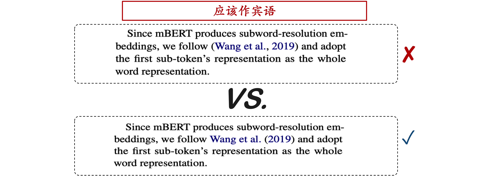

#### 44. 尽量引用发表的版本而非arXiv版本。

* 会显得正规一些

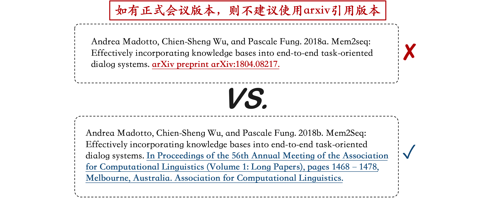

#### 45. 引用条目的格式尽量前后一致

* 如会议名缩写、是否包含会议时间地点等是否所有的参考文献格式保持了一致


## 终稿必查——投稿前一周，一天

### 关于科技英语写习惯

#### 1.  可参考拼写检查软件，检查文本是否有语病或不符习惯的表达。

* 例如 [grammarly](https://app.grammarly.com).

#### 2.  不要使用 didn't can’t don’t isn’t aren’t 之类的缩写形式 任何时候都不要用撇号缩写。对于所有格，完全不要用，非要表达类似意思，用of短语。对于引号，要尽力避免。

#### 3.  使用缩写（如模型名、定义等），需在使用的最初始位置定义。

#### 4.  模型名字大小写保持一致，如BERT，ELECTRA，避免Bert，Electra，electra混合使用。

#### 5.  例句、例子考虑用斜体

#### 6.  \begin\item改成正常段落可以使页面更紧凑（然后在每段前手工加打黑点$\bullet$），浪费过多空间有被怀疑灌水之嫌

#### 7.  脚注的写法：一般情况下，脚注可以写在“脚注相关的地方后第一个非左标点符号（如左引号、左括号）”后面。\footnote命令和它前面的标点符号之间没有空格。

#### 8.  A和an的区别在于发音：an LSTM cell, an F/H/L/M/N/S/X, a U.

#### 9.  文章各级标题的大小写风格统一，例如短语首字母大写或单词首字母大写

### 关于图片：

#### 10.  图片内部的字体应统一且跟正文文字大小一致。

#### 11.  整张图片两侧尽量不要有空白，保持紧凑。

#### 12.  图片通常在每一页的最上方或中间，而不是最下方。

#### 13.  同类型模块颜色尽可能保持一个色系，每类单元用同一个颜色填充或作为边框。

#### 14.  同样色系，如果某个模块颜色更深更亮 ，代表这个模块更为重要。如果不是想表达更为重要，更为核心，请在各个模块之间保持均衡颜色分配，比如灰度值尽量一致。

#### 15.  不得使用过多的颜色种类，颜色最好不要高于六种。

#### 16.  图片使用矢量图。

#### 17.  figure本意是提供比文字更直观、更明了简洁的表达的，应尽可能动用合理的绘画元素，而不是大量用文字标记。figure元素、规范用最小集合、最统一、一致的设置完成，一般不会难看。

#### 18.  细节到线型、配色：第一，保持统一（低描述复杂性），第二，用一个意思、类别的图形元素该用近似、一样的线形、配色（认知直观性）。

#### 19.  箭头方向尽量保持同向，避免出现来回折转。流程图中避免出现孤立组件（无任何来源或去向箭头标识）。

### 关于引用：

#### 20.  引用标记的选取：

* 引用在文字外（parent），使用 \cite。
* 引用在文字内（within text）

  * ACL/NAACL/EMNLP模板使用\citet{...}；
  * COLING模板使用\newcite{...}；
  * AAAI/IJCAI模板使用\citeauthor{...} \shortcite{...}；
  * IEEE模版：\citeauthor{...}~(\citeyear{...})

  效果：(Zhang et al. 2020) vs. Zhang et al. (2020)

#### 21.  如果篇幅较紧张，可以在引用中使用会议期刊名称的缩写。

* 可以参考工具 [SimBiber](https://github.com/MLNLP-World/SimBiber)

#### 22.  bib管理注意保持会议/期刊名称全称和缩写一致性，检查年份、卷号、页码等，不要完全依赖 scholar 提供的信息（可能存在缺失或格式混乱）。

* 可以参考工具 [Rebiber](https://github.com/yuchenlin/rebiber)

#### 23.  章节、表格、图片使用\label定义后，可通过\ref自动引用跳转。

#### 24.  引用和正文之间留有一个空格，而不是紧邻正文字母。

#### 25.  不要重复引用同一论文的不同版本，例如 arXiv和正式会议论文。

### 关于公式：

#### 26.  公式为句子的一部分。因此可在公式内部（尤其是多行）加入逗号和句号。

#### 27.  对于公式后面的文字，若与公式组成完成的句子，则首字母不需要大写，并紧接在公式后面；若另起新的句子或段落，则在公式结束符\end后换行，并句子首字母大写，开启新的句子。

### 投稿前注意事项：

#### 28.  检查匿名性。

#### 28.  检查是否超页（最后时刻慎重勿随意改图表大小）

#### 29.  检查标题和摘要与投稿系统填写框内的信息是否对应。

#### 30.  检查提交的数据与代码，不能包含个人信息，尤其 code 里面一些 hard coded 的模型或数据路径等需要处理掉，另外需要注意隐藏文件夹（如 .git）

#### 31.  Overleaf 在部分会议投稿前可能访问缓慢，请注意LaTex备份

#### 32.  论文的历史版本可以用时间编号，避免提交的不是最终版本

#### 33.  截稿前一天最好提前交一个版本的论文以及附录，防止截稿时服务器崩溃

#### 34.  交稿后仍需要关注会议官网和注册邮箱，以及时收到可能存在的会议截稿日期延后的消息。

##  百家之言

●   [清华大学刘洋老师（CWMT-2014） 的报告](http://nlp.csai.tsinghua.edu.cn/~ly/talks/cwmt14_tut.pdf)

●   [复旦大学邱锡鹏老师（CCL-2018） 的报告](https://xpqiu.github.io/slides/20181019-PaperWriting.pdf)

●   [刘知远老师：如何写一篇合格的NLP论文 ](https://zhuanlan.zhihu.com/p/58752815)

●   [赵鑫《如何以初学者的身份写好一篇国际学术论文》](https://zhuanlan.zhihu.com/p/136005095)

●   [刘一佳博士（NLPCC-2018）的报告](http://yjliu.net/cv/res/2018-08-19-nlpcc-sws.compressed.pdf)

●   [香港中文大学（深圳）助理教授 陈冠英 整理的写作建议](https://github.com/guanyingc/latex_paper_writing_tips) + [Rebuttal Template ](https://github.com/guanyingc/cv_rebuttal_template)

●   [MSRA研究员王晋东：用LaTex写论文经验分享 ](https://mp.weixin.qq.com/s/XshMg6Qb8ArLNA75ImQIWQ)

●   [上海交通大学 张倬胜 整理的写作建议](https://github.com/cooelf/PaperWritingTips)

●   [哥伦比亚大学的Henning Schulzrinne老师的一些学术随笔](http://www.cs.columbia.edu/~hgs/etc/writing.html)（其中也有一个论文写作的collection）

●   [哈佛大学的Whitesides老师从写提纲的角度切入讲解如何撰写学术论文](https://onlinelibrary.wiley.com/doi/pdf/10.1002/adma.200400767)

●   [如何优雅地（用TeX）写AI论文 by 知乎 石昊悦](https://zhuanlan.zhihu.com/p/103519006)

●   [夕小瑶的卖萌屋：11 个好用的科研工具推荐！工作效率提升 max！](https://mp.weixin.qq.com/s/YaPYZvd12Xxgz1Y1L9Rzuw)

●   [夕小瑶的卖萌屋：吐血整理：论文写作中注意这些细节，能显著提升成稿质量](https://mp.weixin.qq.com/s/1ykqoLWjy3WhczAvb_eOoQ)

●   [一份关于公式的建议](http://karlstratos.com/teaching/cs445fall20/short-guide-typesetting.pdf)

●   [使用Tikz在Latex中编写注释方程式的示例](https://github.com/synercys/annotated_latex_equations)

●   [LaTeX建议](https://bochang.me/blog/posts/latex/)

●   [如何让摘要吸引人？Nature论文摘要模板值得收藏](https://zhuanlan.zhihu.com/p/158574876)

●   [支付宝研究员王益的建议：“学好语文，才能写好代码”（很多观点对写论文同样适用）](https://zhuanlan.zhihu.com/p/157243326)

●   [acmi-lab/cmu-10717-the-art-of-the-paper: Official repository for CMU Machine Learning Department&#39;s 10717: &#34;The Art of the Paper&#34;. (github.com)](https://github.com/acmi-lab/cmu-10717-the-art-of-the-paper)

●   [acl-org/aclpubcheck: Tools for checking ACL paper submissions (github.com)](https://github.com/acl-org/aclpubcheck)

●  [dspinellis/latex-advice: Advice for writing LaTeX documents (github.com)](https://github.com/dspinellis/latex-advice)


## 组织者列表

感谢以下同学对本项目进行组织与指导

<a href="https://github.com/Erutan-pku">  </a> 
<a href="https://github.com/cooelf">  </a> 
<a href="https://github.com/SivilTaram">  </a> 
<a href="https://github.com/liucongg">  </a> 
<a href="https://github.com/yhshu">  </a> 
<a href="https://github.com/LooperXX">  </a> 
<a href="https://github.com/kokolerk">  </a> 
<a href="https://github.com/yizhen20133868">  </a> 

## 贡献者列表

感谢以下同学对本项目的支持与贡献

<a href="https://github.com/Erutan-pku">  </a> 
<a href="https://github.com/cooelf">  </a> 
<a href="https://github.com/SivilTaram">  </a> 
<a href="https://github.com/liucongg">  </a> 
<a href="https://github.com/yhshu">  </a> 
<a href="https://github.com/LooperXX">  </a>
<a href="https://github.com/kokolerk">  </a> 
<a href="https://github.com/yizhen20133868">  </a> 
